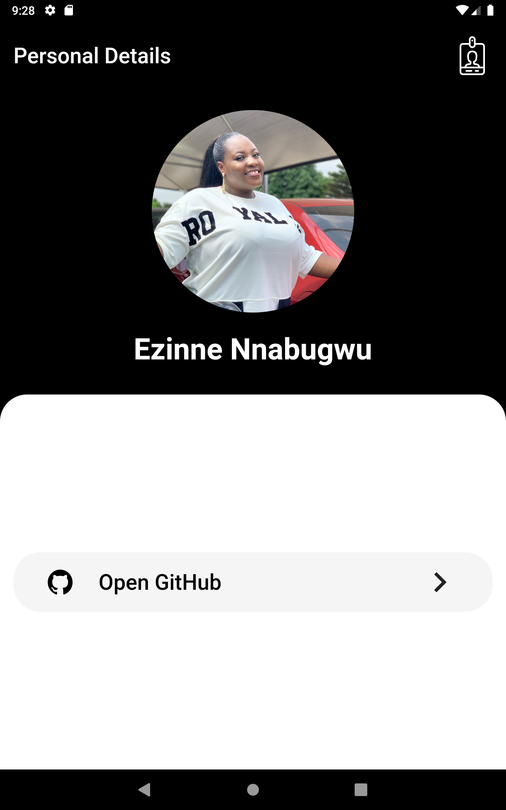

# My Personal Details App



**Task: Create a Mobile Application with Personal Details (HNGX Internship Stage One)**

This Flutter mobile application is developed as part of the HNGX Internship Stage One program. The task is to create a mobile application that prominently features my personal details, including my Slack display picture and name, and includes a "Open GitHub" button that redirects users to my GitHub profile using a WebView component within the application.

Additionally, a virtualized demonstration of the app is available using [Appetize.io](https://appetize.io/) at this [link](https://appetize.io/app/upzo5hnh2ixhbarei7iaguvbgm?device=pixel4&osVersion=11.0&scale=75).

## Table of Contents
- [My Personal Details App](#my-personal-details-app)
  - [Table of Contents](#table-of-contents)
  - [Getting Started](#getting-started)
    - [Prerequisites](#prerequisites)
    - [Installation](#installation)
  - [Usage](#usage)
  - [Features](#features)


## Getting Started
### Prerequisites

Before you begin, ensure you have met the following requirements:
- [Flutter](https://flutter.dev/) installed on your development machine.

### Installation

1. Clone the repository:

```bash
git clone https://github.com/Zinniie/personal_details.git

2. Install dependencies:-  flutter pub get


## Usage
Open the project in your preferred Flutter development environment (e.g., Visual Studio Code or Android Studio).

Connect your mobile device or use an emulator.

Build and run the app: flutter run

Once the app is running, you will see my Slack profile picture and name on the main screen.

Tap the "Open GitHub" button to view my GitHub profile within the app using a WebView component.

## Features
- Display my Slack profile picture and name.
- Easily access my GitHub profile within the app.
- Virtualized demonstration available on Appetize.io
[[here](https://appetize.io/app/upzo5hnh2ixhbarei7iaguvbgm?device=pixel4&osVersion=11.0&scale=75)]
